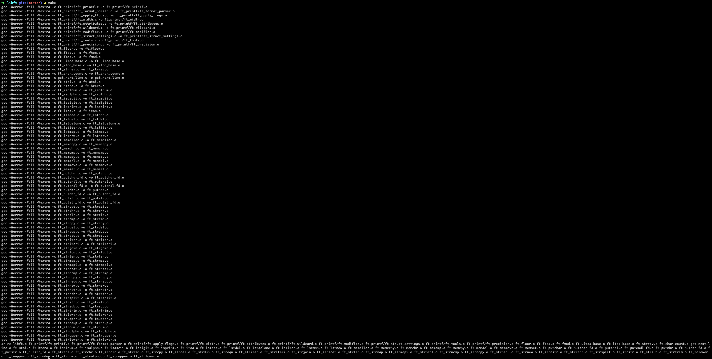

# Libft
Coding our own library of standard C functions @ 42 Paris.

**Project score : [125 / 100]**

Libft was the first project during my cursus at 42. It consists of writing our own standard C functions, using only malloc(3),
free(3), and write(2).


## Installation and usage

```
git clone https://github.com/andrewrzepecki/libft && cd libft && make
```

The Makefile compiles the project and creates a static library named 'libft.a' to be included in all future projects.

**Example:**

```
make
```



42's source code norm was mandatory.
This project allowed me to think about how standard C functions were implemented and practice basic arithmetic on data structures.
